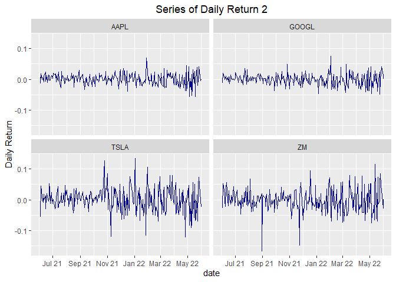

Analysing Stock Data Collected from Polygon.io API
================
Fang Wu

-   [Required Packages](#required-packages)
-   [Define User-friendly Functions to Query
    Data](#define-user-friendly-functions-to-query-data)
    -   [Reference Data Endpoints](#reference-data-endpoints)
    -   [Market Data Endpoints](#market-data-endpoints)
-   [EDA](#eda)
    -   [Analysis on Close Price](#analysis-on-close-price)
    -   [Analysis on Simple Returns](#analysis-on-simple-returns)
    -   [Analysis on Simple Moving
        Average](#analysis-on-simple-moving-average)
    -   [Relationships](#relationships)

This document is a vignette to explain how I collect and perform basic
EDA on stock data from Polygon.io API. In the first session, I built a
few user-friendly functions to interact with the Polygon API to query,
parse, and return well-formatted data. In the second session, I
performed a basic exploratory data analysis (EDA) on historical stock
data for companies – Apple, Google, Tesla, and Zoom.

# Required Packages

I used the following packages to interact with API and do EDA:

-   httr: importing files from Web APIs.

-   dplyr: manipulating data.

-   jsonlite: converting JSON data to R objects.

-   ggplot2: visualizing the data.

-   lubridate: converting string ‘date’ to R date object.

-   zoo: using function `rollmean()` to calculate the moving price.

-   parallel: setting up parallel computing.

-   tidyr: changing the shape of the tibble.

-   GGally: plotting correlation between variables.

-   purrr: combining data frame using `reduce()` function

``` r
library(httr)
library(dplyr)
library(jsonlite)
library(ggplot2)
library(lubridate)
library(zoo)
library(parallel)
library(tidyr)
library(corrplot)
library(GGally)
library(purrr)
```

# Define User-friendly Functions to Query Data

The Polygon.io API provides REST endpoints that let companies and
developers query the latest market data for stocks, options, forex, and
crypto. For each part, there are market data endpoints and reference
data endpoints. In this vignette, I will focus on stock market.

In order to interact with Polygon API and return well-formatted data, I
am going to define some user-friendly functions, which means that users
can customize their query to return specific data. I am going to query
adjusted price as default in the following functions, since adjusted
price incorporates events like splits and dividends distribution, which
can affect the series.

## Reference Data Endpoints

-   Ticker Types

All ticker types that Polygon.io has are listed in this endpoints. I
define a function called `type_info` to connect with this endpoints to
return a tibble with type description, code used in Polygon.io,
asset_class, and locale.

``` r
type_info <- function(class=NULL, locale=NULL){
    mainURL <- "https://api.polygon.io/v3/reference/tickers/types?"
    apikey <- "&apiKey=dJT0WQZ7GwH45bAZ8TBZT3KusMgjNJM2"
    if (! is.null(class)) {class <- paste0("asset_class=", class) }
    if (! is.null(locale)) {locale <- paste0("&locale=", locale) }
    ticker_types <- GET(paste0(mainURL, class, locale,  apikey))
    types_data <- fromJSON(rawToChar(ticker_types$content))
    types <- types_data$results %>% as_tibble() %>% rename(type=description )
    return(types)
}

#check the function to query all types in US stock market 
type_data <- type_info(class="stocks")
type_data
```

    ## # A tibble: 21 x 4
    ##    code    type     asset_class locale
    ##    <chr>   <chr>    <chr>       <chr> 
    ##  1 CS      Common ~ stocks      us    
    ##  2 PFD     Preferr~ stocks      us    
    ##  3 WARRANT Warrant  stocks      us    
    ##  4 RIGHT   Rights   stocks      us    
    ##  5 BOND    Corpora~ stocks      us    
    ##  6 ETF     Exchang~ stocks      us    
    ##  7 ETN     Exchang~ stocks      us    
    ##  8 SP      Structu~ stocks      us    
    ##  9 ADRC    America~ stocks      us    
    ## 10 ADRW    America~ stocks      us    
    ## # ... with 11 more rows

In this tibble, `code` is what Polygon.io uses to refer to `type`. User
can check up the abbreviation for each ticker type through this
function.

Then I define another helper function `convert_to_code` to help user
convert type name to code used in polygon.io. So users can use either
abbreviation or full type name in other data queries.

``` r
convert_to_code <- function(text, class=NULL, locale=NULL){
    types_info <- type_info(class, locale)
    if (text %in% types_info$code){
        return(text)
    } else if  (tolower(text) %in% tolower(types_info$type)){
        return(types_info$code[tolower(types_info$type)==tolower(text)] )
    } else {print("No such type supported by polygon.io")}
}
#check this helper function 
ADRC <- convert_to_code(text="American Depository Receipt Common")
ADRC
```

    ## [1] "ADRC"

-   Tickers

I am going to define a function called `tickers_supported` to query
ticker symbols which are supported by Polygon.io. This function allow
user specify the type of the tickers, market type, and if the tickers
returned should be actively traded on the queried date. With the helper
function `convert_to_code`, user can type the abbreviation for the
ticker type or description.

``` r
tickers_supported <- function(type=NULL, market=NULL, active=TRUE){
    mainURL <- "https://api.polygon.io/v3/reference/tickers?"
    apikey <- "&apiKey=dJT0WQZ7GwH45bAZ8TBZT3KusMgjNJM2"
    limit <- "limit=1000"
    if (! is.null(type)) {type <- paste0("type=",convert_to_code(text=type),"&")}
    if (! is.null(market)) {market <- paste0("market=",market,"&")}
    active <- paste0("active=",active,"&")
    option <- paste0(type,market,active,limit)
    next_url<- TRUE
    tickers_info <- NULL
    while (! is.null(next_url)) {
        tikers_raw <- GET(paste0(mainURL, option, apikey))
        tickers_data <- fromJSON(rawToChar(tikers_raw$content))
        tickers <- tickers_data$results %>% as_tibble()
        tickers_info <- bind_rows(tickers_info, tickers)
        next_url <- tickers_data$next_url
        option <- next_url
    }
    return(tickers_info)
}
#require all ADRC ticker symbols
ADRC_tickers <- tickers_supported(type="American Depository Receipt Common")
ADRC_tickers
```

    ## # A tibble: 1,100 x 12
    ##    ticker name     market locale type 
    ##    <chr>  <chr>    <chr>  <chr>  <chr>
    ##  1 AAALY  AAREAL ~ otc    us     ADRC 
    ##  2 AACAY  AAC TEC~ otc    us     ADRC 
    ##  3 AACG   ATA Cre~ stocks us     ADRC 
    ##  4 AAGIY  AIA GRO~ otc    us     ADRC 
    ##  5 AAGRY  ASTRA A~ otc    us     ADRC 
    ##  6 AARTY  AIRTEL ~ otc    us     ADRC 
    ##  7 AAVMY  ABN AMR~ otc    us     ADRC 
    ##  8 AAYYY  AUSTRAL~ otc    us     ADRC 
    ##  9 ABB    ABB Ltd. stocks us     ADRC 
    ## 10 ABCM   Abcam p~ stocks us     ADRC 
    ## # ... with 1,090 more rows, and 7
    ## #   more variables: active <lgl>,
    ## #   currency_name <chr>,
    ## #   composite_figi <chr>,
    ## #   share_class_figi <chr>,
    ## #   last_updated_utc <chr>,
    ## #   primary_exchange <chr>, ...

## Market Data Endpoints

-   Aggregates (Bars)

This endpoint provides aggregate bars for a stock over a given date
range in custom time window sizes.

First I define a function called `stock_price` to query data for one
specific ticker and return a tibble with more meaningful column names.
User can customize the date range and time window in this function. Then
I use function `lapply` and `stock_price` to generate a tibble for
multiple specified tickers. A wrapper function and parallel computing
process are provided at the end.

``` r
stock_price <- function(ticker, multiplier, timespan, from, to){
    mainURL <- "https://api.polygon.io/v2/aggs"
    apikey <- "?limit=1000&apiKey=dJT0WQZ7GwH45bAZ8TBZT3KusMgjNJM2"
    ticker_sym <- paste0("/ticker/", ticker)
    range <- paste0("/range/", multiplier,"/", timespan)
    from <- paste0("/", from)
    to <- paste0("/", to)
    stock_raw <- GET(paste0(mainURL, ticker_sym, range, from, to, apikey))
    stock_data <- fromJSON(rawToChar(stock_raw$content))
    stock <- stock_data$results %>% as_tibble() %>% 
        rename(close=c, highest=h, lowest=l, open=o, volume=v, 
               volume_weighted_average_price=vw) %>% 
        mutate(ticker=ticker, date=as.Date(as.POSIXct(t/1000, origin = "1970-01-01"))) %>% 
        select(ticker, date, close, highest, lowest, open, volume)
    return(stock)
}

# check to query one ticker data
AAPL_price <- stock_price("AAPL", "1", "day", "2021-06-01", "2022-06-01")
AAPL_price
```

    ## # A tibble: 254 x 7
    ##    ticker date       close highest
    ##    <chr>  <date>     <dbl>   <dbl>
    ##  1 AAPL   2021-06-01  124.    125.
    ##  2 AAPL   2021-06-02  125.    125.
    ##  3 AAPL   2021-06-03  124.    125.
    ##  4 AAPL   2021-06-04  126.    126.
    ##  5 AAPL   2021-06-07  126.    126.
    ##  6 AAPL   2021-06-08  127.    128.
    ##  7 AAPL   2021-06-09  127.    128.
    ##  8 AAPL   2021-06-10  126.    128.
    ##  9 AAPL   2021-06-11  127.    127.
    ## 10 AAPL   2021-06-14  130.    131.
    ## # ... with 244 more rows, and 3 more
    ## #   variables: lowest <dbl>,
    ## #   open <dbl>, volume <dbl>

``` r
# generate tibble about multiple companies
tickers_interest=c("AAPL","ZM","GOOGL","TSLA")
stock_data <- lapply(X=tickers_interest, FUN=stock_price, multiplier="1",
                         timespan="day",from="2021-06-01", to="2022-06-01") %>%
    reduce(bind_rows)
stock_data
```

    ## # A tibble: 1,016 x 7
    ##    ticker date       close highest
    ##    <chr>  <date>     <dbl>   <dbl>
    ##  1 AAPL   2021-06-01  124.    125.
    ##  2 AAPL   2021-06-02  125.    125.
    ##  3 AAPL   2021-06-03  124.    125.
    ##  4 AAPL   2021-06-04  126.    126.
    ##  5 AAPL   2021-06-07  126.    126.
    ##  6 AAPL   2021-06-08  127.    128.
    ##  7 AAPL   2021-06-09  127.    128.
    ##  8 AAPL   2021-06-10  126.    128.
    ##  9 AAPL   2021-06-11  127.    127.
    ## 10 AAPL   2021-06-14  130.    131.
    ## # ... with 1,006 more rows, and 3
    ## #   more variables: lowest <dbl>,
    ## #   open <dbl>, volume <dbl>

Wrapper function to get the same data.

``` r
# wrapper function
get_price <- function(tickers, num, span, start, end){
    stock_data <- lapply(X=tickers, FUN=stock_price, multiplier=num,
                         timespan=span, from=start, to=end) %>% reduce(bind_rows)
    return(stock_data)
}

get_price(tickers=c("AAPL"), num="2",span="month",start="2021-01-01", end="2022-06-01" )
```

    ## Error in `chr_as_locations()`:
    ## ! Can't rename columns that don't exist.
    ## x Column `c` doesn't exist.

Parallel computing process to get the same data.

``` r
#set up parallel process
cluster <- makeCluster(detectCores()-1)
clusterExport(cluster, list("stock_price", "fromJSON", "rawToChar"))
void <- capture.output(clusterEvalQ(cluster,{library(tidyverse)}))
void <- capture.output(clusterEvalQ(cluster,{library(httr)}))
result <- parLapply(cluster, X=tickers_interest, fun=stock_price, multiplier="1",
                         timespan="month",from="2022-01-01", to="2022-06-01")
```

    ## Error in checkForRemoteErrors(val): 4 nodes produced errors; first error: Can't rename columns that don't exist.
    ## x Column `c` doesn't exist.

``` r
reduce(result, bind_rows)
```

    ## # A tibble: 24 x 7
    ##    ticker date       close highest
    ##    <chr>  <date>     <dbl>   <dbl>
    ##  1 AAPL   2022-01-01 175.     183.
    ##  2 AAPL   2022-02-01 165.     177.
    ##  3 AAPL   2022-03-01 175.     180.
    ##  4 AAPL   2022-04-01 158.     178.
    ##  5 AAPL   2022-05-01 149.     166.
    ##  6 AAPL   2022-06-01 142.     152.
    ##  7 ZM     2022-01-01 154.     185.
    ##  8 ZM     2022-02-01 133.     156.
    ##  9 ZM     2022-03-01 117.     136 
    ## 10 ZM     2022-04-01  99.6    126.
    ## # ... with 14 more rows, and 3 more
    ## #   variables: lowest <dbl>,
    ## #   open <dbl>, volume <dbl>

-   Grouped Daily (Bars)

This endpoint provides the daily open, high, low, and close price
information for the entire stocks/equities markets.

I am going to define a function named `one_day` to connect the API and
return a tibble. Users can specify the date through this funciton.

``` r
one_day <- function(date){
    mainURL <- "https://api.polygon.io/v2/aggs/grouped/locale/us/market/stocks/"
    apikey <- "?adjusted=true&apiKey=dJT0WQZ7GwH45bAZ8TBZT3KusMgjNJM2"
    date_raw <- GET(paste0(mainURL, date, apikey))
    date_data <- fromJSON(rawToChar(date_raw$content))
    date_info <- date_data$results %>% as_tibble() %>% rename( close=c,
                      highest=h, lowest=l, ransactions=n, open=o, volume=v,) %>%
                     select(T, open, close, highest, lowest, volume)
    return(date_info)
}
#check entire market on 2022-06-21
Jun21 <- one_day(date="2022-06-21")
```

    ## Error in `chr_as_locations()`:
    ## ! Can't rename columns that don't exist.
    ## x Column `c` doesn't exist.

``` r
Jun21
```

    ## Error in eval(expr, envir, enclos): object 'Jun21' not found

# EDA

I want to explore daily stock price changes for companies Apply, Google,
Tesla, and Zoom from 2001-06-01 to 2022-06-01. So I will use tibble
*stock_data* gained in the last session.

I am going to perform basic EDA on close price, returns, and moving
price to explore some interesting trends and relationships.

## Analysis on Close Price

Let’s find some trends of the daily close price.

``` r
g <- ggplot(stock_data, aes(x=date, y=close, color=ticker))
g + geom_line() +
    labs(x="Date", y="Close Price", title="Series of Daily Close Price") +
    theme(plot.title = element_text(hjust = 0.5)) +
    scale_x_date(date_labels = "%b %y", date_breaks="2 months") 
```

<!-- -->

We can find: Google’s stock is much more expensive than the others’;
ZM’s close price continued to drop down; GOOGL and TSLA’s close price
waved a lot in the past year; AAPL’s price appears to not deviate much
in the plot;

Because of the large price difference, I am not sure whether the
stability of AAPL is ture.

In addition, I am going to get some descriptive statistics for the close
price movement. Compare their standard deviation and IQR to check their
volatility.

``` r
summary_table <- stock_data %>% group_by(ticker) %>% summarise(q1=quantile(close, 0.25), mean=mean(close), median=median(close), q3=quantile(close, 0.75), sd=sd(close), IQR=IQR(close))
summary_table
```

    ## # A tibble: 4 x 7
    ##   ticker    q1  mean median    q3
    ##   <chr>  <dbl> <dbl>  <dbl> <dbl>
    ## 1 AAPL    146.  155.   152.  167.
    ## 2 GOOGL  2539. 2682.  2725. 2843.
    ## 3 TSLA    711.  859.   842. 1009.
    ## 4 ZM      123.  225.   207.  315.
    ## # ... with 2 more variables:
    ## #   sd <dbl>, IQR <dbl>

In this table we can find that the standard deviation and IQR of AAPL is
indeed much lower than the others’. The mean and median of GOOGL is
indeed much higher than the others.

We can also check the spread by the following box plot.

``` r
g <- ggplot(stock_data, aes(x=ticker, y=close))
g + geom_boxplot(aes(color=ticker)) +
    theme(plot.title = element_text(hjust = 0.5)) +
    labs(y="close price", title="Box Plot for Close Price Across Tickers") 
```

<!-- -->

The boxes of GOOGL and TSLA are similar, while ZM’s box is smaller.
Meanwhile, the box of AAPL is like a line in the plot, which indicates
that close price of AAPL is very stable.

## Analysis on Simple Returns

To solve the problem caused by the high price difference, we will
analyze the simple returns instead of close prices in this part.

First, I am going to define a function to calculate returns and create a
new tibble named `return_data.`

``` r
get_returns <- function(data_set){
    returns <- function(x){
        n=length(x)
        returns <- c(NA, (x[2:n]-x[1:(n-1)])/(x[1:(n-1)]))
        return(returns)
    }
    new_data <- data_set %>% group_by(ticker) %>% mutate(return=returns(close)) %>% 
        select(ticker, date, close, return, volume) %>% ungroup()
    return(new_data)
}
#get new tibble
return_data <- get_returns(stock_data)
return_data
```

    ## # A tibble: 1,016 x 5
    ##    ticker date       close     return
    ##    <chr>  <date>     <dbl>      <dbl>
    ##  1 AAPL   2021-06-01  124. NA        
    ##  2 AAPL   2021-06-02  125.  0.00628  
    ##  3 AAPL   2021-06-03  124. -0.0122   
    ##  4 AAPL   2021-06-04  126.  0.0190   
    ##  5 AAPL   2021-06-07  126.  0.0000794
    ##  6 AAPL   2021-06-08  127.  0.00667  
    ##  7 AAPL   2021-06-09  127.  0.00308  
    ##  8 AAPL   2021-06-10  126. -0.00802  
    ##  9 AAPL   2021-06-11  127.  0.00983  
    ## 10 AAPL   2021-06-14  130.  0.0246   
    ## # ... with 1,006 more rows, and 1
    ## #   more variable: volume <dbl>

Now let’s calculate the descriptive statistics of returns.

``` r
return_table <- return_data %>% group_by(ticker) %>% summarise(q1=quantile(return, 0.25, na.rm=TRUE), mean=mean(return, na.rm=TRUE), median=median(return, na.rm=TRUE), q3=quantile(return, 0.75, na.rm=TRUE), sd=sd(return, na.rm=TRUE), IQR=IQR(return, na.rm=TRUE))
return_table
```

    ## # A tibble: 4 x 7
    ##   ticker       q1       mean    median
    ##   <chr>     <dbl>      <dbl>     <dbl>
    ## 1 AAPL   -0.00910  0.000866   0.00114 
    ## 2 GOOGL  -0.00922 -0.0000121  0.000963
    ## 3 TSLA   -0.0174   0.00136    0.00201 
    ## 4 ZM     -0.0244  -0.00375   -0.00476 
    ## # ... with 3 more variables:
    ## #   q3 <dbl>, sd <dbl>, IQR <dbl>

I want visulize this table in the followin gplot.

``` r
g <- ggplot(return_table, aes(x=ticker))
g + geom_bar(aes(y=mean), stat="identity", fill="dark blue")+
    labs(y="mean return", title="Mean of the Daily Returns")
```

<!-- -->

The mean return of GOOGL over the past year is so close to 0, while it
is negative for ZM and positive for AAPL and TSLA.

``` r
g <- ggplot(return_table, aes(x=ticker))
g + geom_bar(aes(y=sd), stat="identity", fill="dark blue")+
    labs(y="return's sd", title="Standard Deviation of the Daily Returns")
```

<!-- -->

Which is very surprising to me is that ZM has a relatively high
deviation and GOOGL has a relative low deviation in terms of returns.

We also check the spreadin the box plot.

``` r
g <- ggplot(return_data, aes(x=ticker, y=return))
g + geom_boxplot(aes(color=ticker)) +
    theme(plot.title = element_text(hjust = 0.5)) +
    labs(y="return", title="Box Plot for Returns Across Tickers") 
```

<!-- -->

From this plot we can see clearly that the medians are all pretty close
to zero, and the variations are similar between AAPL and GOOGL, TSLA and
ZM separately. There seems like be more far away outliers in TSLA and ZM
than in AAPL and GOOGL. Two much lower values in the ZM may account for
some part of its negative mean return.

Now I want to cut returns into different levels and check how many
records fallen down within each level for each ticker.

``` r
new <- return_data %>% mutate(rlev=cut(return, breaks=5, labels=c("very bad", "bad", "close 0", "good", "very good")))
table(new$ticker, new$rlev)
```

    ##        
    ##         very bad bad close 0 good
    ##   AAPL         0   3     198   52
    ##   GOOGL        0   2     209   41
    ##   TSLA         3  24     141   78
    ##   ZM           2  21     169   55
    ##        
    ##         very good
    ##   AAPL          0
    ##   GOOGL         1
    ##   TSLA          7
    ##   ZM            6

From this contingency table, we can find that there are both some very
bad and very good values in TSLA and ZM, which indicates the large daily
changes exist.

Let’s check their histogram.

``` r
g <- ggplot(return_data, aes(x=return))
g + geom_histogram( fill="darkblue") +
    labs(y="Daily Return", title="Histogram of Daily Return") +
    theme(plot.title = element_text(hjust = 0.5)) +
    facet_wrap(~ticker)
```

<!-- -->

As expected, lots of activity appear in the middle, however the plots
spread out to the left and right far for TSLA and ZM. These two plots
have fat tails as indicated in the contingency table.

Now let’s check the trend of the `return`.

``` r
g <- ggplot(return_data, aes(x=date, y=return))
g + geom_line(aes(color=ticker)) +
    labs(y="Daily Return", title="Series of Daily Return") +
    theme(plot.title = element_text(hjust = 0.5)) +
    scale_x_date(date_labels = "%b %y", date_breaks="2 months")
```

<!-- -->

We can find some large events, though this is not a very neat plot. I am
going to make subplot by ticker to give more clear comparison.

``` r
g <- ggplot(return_data, aes(x=date, y=return))
g + geom_line(color="dark blue") +
    labs(y="Daily Return", title="Series of Daily Return 2") +
    facet_wrap(~ticker) +
    theme(plot.title = element_text(hjust = 0.5)) +
    scale_x_date(date_labels = "%b %y", date_breaks="2 months")
```

<!-- -->

From this plot, we can see that the daily returns jumps around a lot as
we might expect. They basically cluster around zero. There are some
unpredictable variation, especially some really large events in TSLA and
ZM.

To my surprise, GOOGL is much more stable here than in series of daily
closing price plot.

## Analysis on Simple Moving Average

A q-day moving average is, for a series

and a point in time t, the average of the past q days: that is, if

denotes a moving average process,
then:

This indicator is interesting because it helps us to identify trends and
smooths noises from prices. That is, the bigger the days window for the
moving average calculation, smaller is the MA responsiveness to price
variation. Now let’s calculate two moving averages for the stock prices
series, one with 10 days window and the other with 30 days:

``` r
get_moving_mean <- function(data_set,window){
    moving_mean <- function(x,window){
        moving_mean <- rollmean(x, k=window, fill=list(NA, NULL, NA), align="right")
        return(moving_mean)
    }
    new_data <- data_set %>% group_by(ticker) %>%
        mutate(mean10=moving_mean(close,10),mean30=moving_mean(close,30))
    return(new_data)
}
#test new function
moving_mean_data <- stock_data %>% get_moving_mean(10) %>%  get_moving_mean(30) %>% select(ticker, date, close, mean10, mean30)
moving_mean_data
```

    ## # A tibble: 1,016 x 5
    ## # Groups:   ticker [4]
    ##    ticker date       close mean10
    ##    <chr>  <date>     <dbl>  <dbl>
    ##  1 AAPL   2021-06-01  124.    NA 
    ##  2 AAPL   2021-06-02  125.    NA 
    ##  3 AAPL   2021-06-03  124.    NA 
    ##  4 AAPL   2021-06-04  126.    NA 
    ##  5 AAPL   2021-06-07  126.    NA 
    ##  6 AAPL   2021-06-08  127.    NA 
    ##  7 AAPL   2021-06-09  127.    NA 
    ##  8 AAPL   2021-06-10  126.    NA 
    ##  9 AAPL   2021-06-11  127.    NA 
    ## 10 AAPL   2021-06-14  130.   126.
    ## # ... with 1,006 more rows, and 1
    ## #   more variable: mean30 <dbl>

We calculated the two moving average using 10 and 30 days of windows,
filling the values with NA and using the periods in the left.
Afterwards, we can plot both series in the same graphic of prices to
identify trends.

``` r
g <- ggplot(moving_mean_data, aes(x=date))
g + geom_line(aes(y=close, color="close")) +
    geom_line(aes(y=mean10, color="mean10")) +
    geom_line(aes(y=mean30, color="mean30")) +
    labs(x="Date", y="Price", title="Series of Close Price And Moving Mean") +
    theme(plot.title = element_text(hjust = 0.5)) +
    facet_wrap(~ticker, scales="free")
```

<!-- -->

``` r
    scale_x_date(date_labels = "%b %y", date_breaks="2 months")
```

    ## <ScaleContinuousDate>
    ##  Range:  
    ##  Limits:    0 --    1

As what we expected, the line for mean30 is the most smooth one.

From this plot we can see:

-   The moving means and close price of ZM continued to fall.

-   AAPL had a big increase from Oct/2021 to Apr/2022.

-   In 2021, the moving means of TSLA went up, then it started to wave
    in a large range.

-   From April 2022, all these four tickers started to fall down.

## Relationships

-   relationship between volume and returns

I guess there would be some relationship between volume and returns.

``` r
g <- ggplot(return_data, aes(x=return, y=volume))
g + geom_point(aes(color=ticker)) 
```

<!-- -->
We can see that days with larger absolute return values are more likely
to have larger volume. But larger volumes don’t mean larger absolute
return values.

-   correlation between tickers’ returns

``` r
#change tibble to wider tibble with ticker code as column names
new_wider <- return_data %>% select(ticker, date, return) %>% pivot_wider(names_from=ticker, values_from=return)
#calculate correlation between tickers' returns
GGally::ggpairs(new_wider%>%select(-date))
```

<!-- -->

What is very interesting is that these four tickers’ returns have
pair-wise positive correlation. Maybe this is because they are all top
tech company ? Or this is a normal phenomenon in the past year?

The correlation between AAPL and GOOGL is as high as 0.7.

``` r
g <- ggplot(new_wider, aes(x=AAPL, y=GOOGL))
g + geom_point(position="jitter") +
    geom_smooth(method=lm, colors="blue") +
    geom_text(x=0.03, y=-0.025, size=5, label="Correlation = 0.704")
```

<!-- -->

The linear regression line seems fit the data pretty well.
