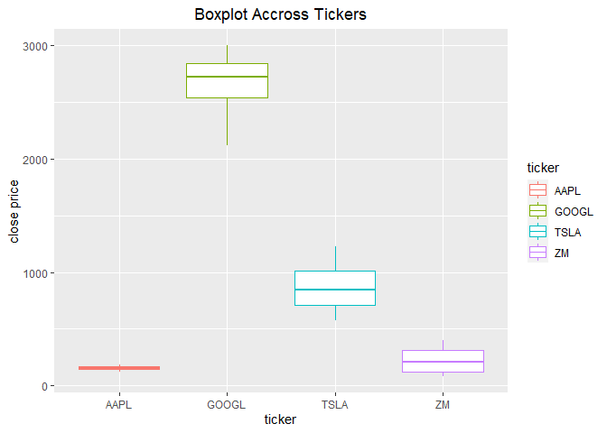
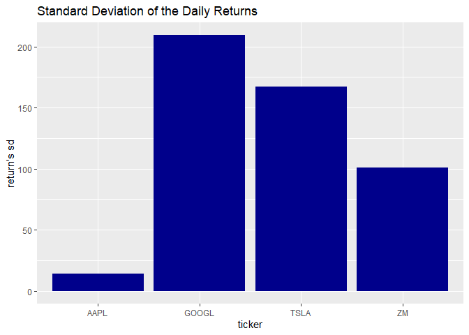

Analysing Stock Data from API
================
Fang Wu

``` r
knitr::opts_chunk$set(echo=TRUE, message = FALSE, warning=FALSE)
```

This document is a vignette to show how to retrieve stock data from
Polygon.io API and summarizing stock data using R. First, I am going to
build a few user friendly functions to interact with Polygon API and
return well-formatted data. After that, I am going to perform a basic
exploratory data analysis (EDA) on the responses.

## Required Packages

I used the following packages to interact with API and analyse the data:

-   httr: importing files from Web APIs

-   dplyr: manipulating data

-   jsonlite: converting JSON data to R objects

-   ggplot2: visualizing the data

``` r
library(httr)
library(dplyr)
library(jsonlite)
library(ggplot2)
library(purrr)
library(lubridate)
```

## API Interaction Functions

I define some use friendly functions to interact with Polygon API to
return well-formatted data. I am going to query adjusted price in the
following functions as default, since adjusted price incorporates events
like splits and dividends distribution, which can affect the series.

-   Ticker Types

Helper function to check up the abbreviation for the ticker type.

``` r
check_type_code <- function(test, class=NULL, locale=NULL){
    mainURL <- "https://api.polygon.io/v3/reference/tickers/types?"
    apikey <- "&apiKey=dJT0WQZ7GwH45bAZ8TBZT3KusMgjNJM2"
    if (! is.null(class)) {class <- paste0("asset_class=", class) }
    if (! is.null(locale)) {locale <- paste0("&locale=", locale) }
    ticker_types <- GET(paste0(mainURL, class, locale,  apikey))
    types_data <- fromJSON(rawToChar(ticker_types$content))
    types_info <- types_data$results %>% as_tibble() %>% rename(type=description )
    if (test %in% types_info$code){
        return(test)
    } else if  (tolower(test) %in% tolower(types_info$type)){
        return(types_info$code[tolower(types_info$type)==tolower(test)] )
    } else {print("No such type supported by polygon.io")}
}
#check
check_type_code(test="common stock")
```

    ## [1] "CS"

-   Supported Tickers

Function to check all the tickers supplied by API. User can specify the
type of the tickers, market type, and if the tickers returned should be
actively traded on the queried date. With the helper function
`check_type_code`, user don’t be required to type the abbreviation for
the ticker type.

``` r
tickers_supported <- function(type=NULL, market=NULL, active=TRUE){
    mainURL <- "https://api.polygon.io/v3/reference/tickers?"
    apikey <- "&apiKey=dJT0WQZ7GwH45bAZ8TBZT3KusMgjNJM2"
    limit <- "limit=1000"
    if (! is.null(type)) {type <- paste0("type=",check_type_code(type),"&")}
    if (! is.null(market)) {market <- paste0("market=",market,"&")}
    active <- paste0("active=",active,"&")
    option <- paste0(type,market,active,limit)
    next_url<- TRUE
    tickers_info <- NULL
    while (! is.null(next_url)) {
        tikers_raw <- GET(paste0(mainURL, option, apikey))
        tickers_data <- fromJSON(rawToChar(tikers_raw$content))
        tickers <- tickers_data$results %>% as_tibble()
        tickers_info <- bind_rows(tickers_info, tickers)
        next_url <- tickers_data$next_url
        option <- next_url
    }
    return(tickers_info)
}
#check all CS tickers
tickers_supported(type="CS", market="stocks")
```

    ## # A tibble: 1,200 x 12
    ##    ticker name         market locale
    ##    <chr>  <chr>        <chr>  <chr> 
    ##  1 A      Agilent Tec~ stocks us    
    ##  2 AA     Alcoa Corpo~ stocks us    
    ##  3 AAC    Ares Acquis~ stocks us    
    ##  4 AACI   Armada Acqu~ stocks us    
    ##  5 AADI   Aadi Biosci~ stocks us    
    ##  6 AAIC   Arlington A~ stocks us    
    ##  7 AAL    American Ai~ stocks us    
    ##  8 AAMC   Altisource ~ stocks us    
    ##  9 AAME   Atlantic Am~ stocks us    
    ## 10 AAN    The Aaron's~ stocks us    
    ## # ... with 1,190 more rows, and 8
    ## #   more variables:
    ## #   primary_exchange <chr>,
    ## #   type <chr>, active <lgl>,
    ## #   currency_name <chr>, cik <chr>,
    ## #   composite_figi <chr>,
    ## #   share_class_figi <chr>, ...

-   Grouped Daily (Bars)

Get the daily open, high, low, and close price information for the
entire stocks/equities markets.

``` r
date_perform <- function(date){
    mainURL <- "https://api.polygon.io/v2/aggs/grouped/locale/us/market/stocks/"
    apikey <- "?adjusted=true&apiKey=dJT0WQZ7GwH45bAZ8TBZT3KusMgjNJM2"
    date_raw <- GET(paste0(mainURL, date, apikey))
    date_data <- fromJSON(rawToChar(date_raw$content))
    date_info <- date_data$results %>% as_tibble() %>% rename(ticker=T, close=c,
                      highest=h, lowest=l, ransactions=n, open=o, volume=v,) %>%
                     select(ticker, open, close, highest, lowest, volume)
    return(date_info)
}
#check function
date_perform("2022-06-10")
```

    ## # A tibble: 11,107 x 6
    ##    ticker   open  close highest
    ##    <chr>   <dbl>  <dbl>   <dbl>
    ##  1 EFAD    35.2   35.1    35.2 
    ##  2 ALC     70.5   70.1    70.9 
    ##  3 JNUG    47.8   54.0    54.6 
    ##  4 PXD    275.   271.    278.  
    ##  5 VYM    107.   106.    107.  
    ##  6 VZ      50.6   50.8    51.4 
    ##  7 CNXN    44.4   44.2    44.5 
    ##  8 BMBL    30.1   30.4    31.3 
    ##  9 VCSA     3.19   2.92    3.26
    ## 10 HOFT    17.7   16.6    17.7 
    ## # ... with 11,097 more rows, and 2
    ## #   more variables: lowest <dbl>,
    ## #   volume <dbl>

-   Aggregates (Bars)

Define function to get stock price data for specified stocks over a
given date range in custom time window sizes. For example, we want to
query daily price data for company Apply, Google, Tesla, and Zoom from
2001-06-01 to 2022-06-01 from Polygon API.

``` r
stock_price <- function(ticker, multiplier, timespan, from, to){
    mainURL <- "https://api.polygon.io/v2/aggs"
    apikey <- "?limit=1000&apiKey=dJT0WQZ7GwH45bAZ8TBZT3KusMgjNJM2"
    range <- paste0("/range/", multiplier,"/", timespan)
    from <- paste0("/", from)
    to <- paste0("/", to)
    stock_info <- NULL
    for (i in ticker){
        ticker <- paste0("/ticker/", i)
        stock_raw <- GET(paste0(mainURL, ticker, range, from, to, apikey))
        stock_data <- fromJSON(rawToChar(stock_raw$content))
        stock <- stock_data$results %>% as_tibble() %>% 
            rename(close=c, highest=h, lowest=l, open=o, volume=v,
                   volume_weighted_average_price=vw) %>% 
            mutate(ticker=i, date=as.Date(as.POSIXct(t/1000, origin = "1970-01-01"))) %>%                     select(ticker, date, close, highest, lowest, open, volume)
        stock_info = bind_rows(stock_info, stock)
    }                   
    return(stock_info)
}
```

## EDA

### Query Daily Price From API

As I am interested in company Apple, zoom, Google and Tesla, I query
their daily price data from 2001-06-01 to 2022-06-01 from Polygon API.

``` r
stock_data <- stock_price(ticker=c("AAPL","ZM","GOOGL","TSLA"), multiplier="1",
                         timespan="day",from="2021-06-01", to="2022-06-01") 
stock_data
```

    ## # A tibble: 1,016 x 7
    ##    ticker date       close highest
    ##    <chr>  <date>     <dbl>   <dbl>
    ##  1 AAPL   2021-06-01  124.    125.
    ##  2 AAPL   2021-06-02  125.    125.
    ##  3 AAPL   2021-06-03  124.    125.
    ##  4 AAPL   2021-06-04  126.    126.
    ##  5 AAPL   2021-06-07  126.    126.
    ##  6 AAPL   2021-06-08  127.    128.
    ##  7 AAPL   2021-06-09  127.    128.
    ##  8 AAPL   2021-06-10  126.    128.
    ##  9 AAPL   2021-06-11  127.    127.
    ## 10 AAPL   2021-06-14  130.    131.
    ## # ... with 1,006 more rows, and 3
    ## #   more variables: lowest <dbl>,
    ## #   open <dbl>, volume <dbl>

### Analyzing Close Price

Now let’s compare daily close prices between these four companies.

``` r
g <- ggplot(stock_data, aes(x=date, y=close, color=ticker))
g + geom_line() +
    labs(x="Date", y="Close Price", title="Series of Daily Close Price") +
    theme(plot.title = element_text(hjust = 0.5)) +
    scale_x_date(date_labels = "%b %y", date_breaks="2 months") 
```

<!-- -->

Google’s stock is much more expensive than the others’, and this
difference makes Apple’s and Zoom’s stocks appear much less volatile
than they truly are (that is, their price appears to not deviate much).
Actually, we find the deviation for Zoom is not small from the following
table.

``` r
stock_data %>% group_by(ticker) %>% summarise(avg=mean(close), sd=sd(close), median=median(close))
```

    ## # A tibble: 4 x 4
    ##   ticker   avg    sd median
    ##   <chr>  <dbl> <dbl>  <dbl>
    ## 1 AAPL    155.  13.9   152.
    ## 2 GOOGL  2682. 209.   2725.
    ## 3 TSLA    859. 167.    842.
    ## 4 ZM      225. 101.    207.

``` r
g <- ggplot(stock_data, aes(x=ticker, y=close))
g + geom_boxplot(aes(color=ticker)) 
```

<!-- -->

A solution would be to plot the stock’s daily returns.

### Simple returns

First, I am going to define a function to calculate simple returns.

``` r
get_returns <- function(data_set){
    returns <- function(x){
        returns <- c(NA, (x[2:n]-x[1:(n-1)])/(x[1:(n-1)]))
        return(returns)
    }
    new_set=NULL
    for (i in unique(data_set$ticker)){
        data <- stock_data %>% filter(ticker==i)
        n <- nrow(data)
        data <- data %>% mutate(returns=returns(data$close))
        new_set <- bind_rows(new_set, data)
    }
    return(new_set)
}
#test new function
return_data <- get_returns(stock_data)
return_data
```

    ## # A tibble: 1,016 x 8
    ##    ticker date       close highest
    ##    <chr>  <date>     <dbl>   <dbl>
    ##  1 AAPL   2021-06-01  124.    125.
    ##  2 AAPL   2021-06-02  125.    125.
    ##  3 AAPL   2021-06-03  124.    125.
    ##  4 AAPL   2021-06-04  126.    126.
    ##  5 AAPL   2021-06-07  126.    126.
    ##  6 AAPL   2021-06-08  127.    128.
    ##  7 AAPL   2021-06-09  127.    128.
    ##  8 AAPL   2021-06-10  126.    128.
    ##  9 AAPL   2021-06-11  127.    127.
    ## 10 AAPL   2021-06-14  130.    131.
    ## # ... with 1,006 more rows, and 4
    ## #   more variables: lowest <dbl>,
    ## #   open <dbl>, volume <dbl>,
    ## #   returns <dbl>

Now let’s check returns distribution and spread.

``` r
g <- ggplot(return_data, aes(x=date, y=returns))
g + geom_line(color="darkblue") +
    labs(y="Daily Return", title="Series of Daily Return") +
    theme(plot.title = element_text(hjust = 0.5)) +
    facet_wrap(~ticker) +
    scale_x_date(date_labels = "%b %y", date_breaks="2 months")
```

<!-- -->

``` r
return_data %>% group_by(ticker) %>% summarise(avg=mean(returns,na.rm=TRUE), sd=sd(returns,na.rm=TRUE), median=median(returns,na.rm=TRUE))
```

    ## # A tibble: 4 x 4
    ##   ticker        avg     sd    median
    ##   <chr>       <dbl>  <dbl>     <dbl>
    ## 1 AAPL    0.000866  0.0177  0.00114 
    ## 2 GOOGL  -0.0000121 0.0181  0.000963
    ## 3 TSLA    0.00136   0.0371  0.00201 
    ## 4 ZM     -0.00375   0.0358 -0.00476

Which is very surprising is that ZM has a relatively high deviation and
GOOGL has a relative low deviation in terms of returns.

``` r
g <- ggplot(return_data, aes(x=returns))
g + geom_histogram(color="blue", fill="darkblue") +
    labs(y="Daily Return", title="Histogram of Daily Return") +
    theme(plot.title = element_text(hjust = 0.5)) +
    facet_wrap(~ticker)
```

<!-- -->

The distribution of returns for apple is almost symetrical, while the
distribution of returns for TSLA and ZM have fat tails.

### Simple Moving Average

A q-day moving average is, for a series

and a point in time t, the average of the past q days: that is, if

denotes a moving average process, then:


This indicator is interesting because it helps to identify trends and
smooths noises from prices. That is, the bigger the days window for the
moving average calculation, smaller is the MA responsiveness to price
variation. The smaller the window, the faster MA adapts itself to
changes. Now let’s calculate two moving averages for the stock prices
series, one with 10 days window and the other with 30 days:

``` r
get_moving_mean <- function(data_set,window){
    moving_mean <- function(x,window){
        moving_mean <- rollmean(x, k=window, fill=list(NA, NULL, NA), align="right")
        return(moving_mean)
    }
    new_set=NULL
    for (i in unique(data_set$ticker)){
        data <- data_set %>% filter(ticker==i)
        varname=paste0("mean", window)
        data[[varname]] <- with(data,moving_mean(data$close,window))
        new_set <- bind_rows(new_set, data)
    }
    return(new_set)
}
#test new function
moving_mean_data <- stock_data %>% get_moving_mean(10) %>%  get_moving_mean(30)
moving_mean_data
```

    ## # A tibble: 1,016 x 9
    ##    ticker date       close highest
    ##    <chr>  <date>     <dbl>   <dbl>
    ##  1 AAPL   2021-06-01  124.    125.
    ##  2 AAPL   2021-06-02  125.    125.
    ##  3 AAPL   2021-06-03  124.    125.
    ##  4 AAPL   2021-06-04  126.    126.
    ##  5 AAPL   2021-06-07  126.    126.
    ##  6 AAPL   2021-06-08  127.    128.
    ##  7 AAPL   2021-06-09  127.    128.
    ##  8 AAPL   2021-06-10  126.    128.
    ##  9 AAPL   2021-06-11  127.    127.
    ## 10 AAPL   2021-06-14  130.    131.
    ## # ... with 1,006 more rows, and 5
    ## #   more variables: lowest <dbl>,
    ## #   open <dbl>, volume <dbl>,
    ## #   mean10 <dbl>, mean30 <dbl>

We calculated the two moving average using 10 and 30 days of windows,
filling the values with NA and using the periods in the left.
Afterwards, we can plot both series in the same graphic of prices to
identify trends.

``` r
g <- ggplot(moving_mean_data, aes(x=date))
g + geom_line(aes(y=close, color="close")) +
    geom_line(aes(y=mean10, color="mean10")) +
    geom_line(aes(y=mean30, color="mean30")) +
    labs(x="Date", y="Close Price", title="Price Series of AAPL") +
    theme(plot.title = element_text(hjust = 0.5)) +
    facet_wrap(~ticker) +
    scale_x_date(date_labels = "%b %y", date_breaks="2 months")
```

<!-- -->

### Relationship between volume and returns

``` r
g <- ggplot(return_data, aes(x=returns, y=volume))
g + geom_point() +
    facet_wrap(~ticker)
```

<!-- -->
