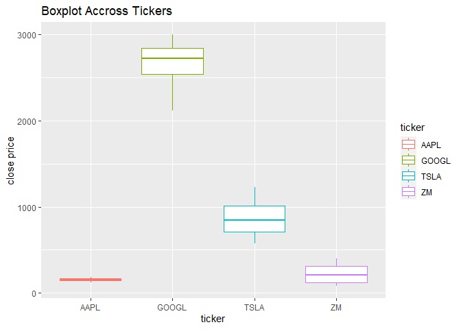
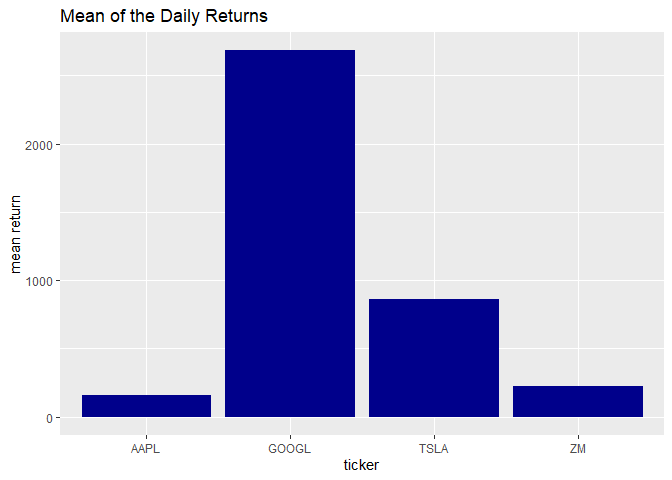
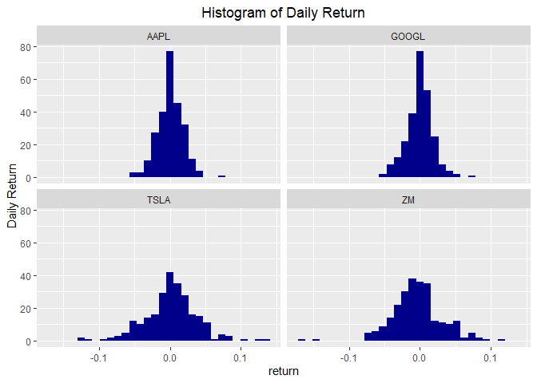
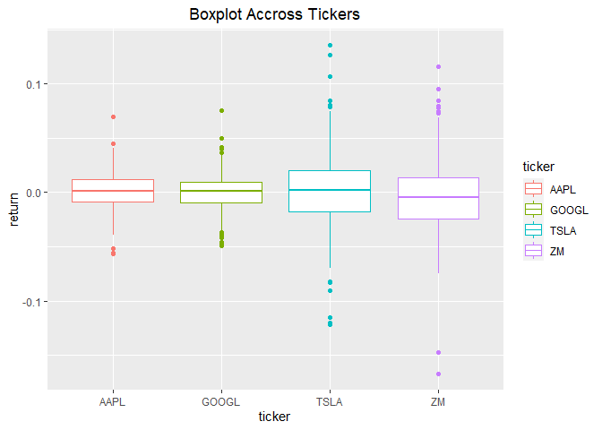

Analysing Stock Data Collected from Polygon.io API
================
Fang Wu

This document is a vignette to show how I collect stock data from
Polygon.io API and perform EDA on stock data. In the first session, I am
going to build a few user friendly functions in order to interact with
Polygon API and retrieve well-formatted data. In the second session, I
am going to perform a basic exploratory data analysis (EDA) on the data
to find some interesting trends and relationship.

# Required Packages

I used the following packages to interact with API and do EDA:

-   httr: importing files from Web APIs.

-   dplyr: manipulating data.

-   jsonlite: converting JSON data to R objects.

-   ggplot2: visualizing the data.

-   purrr:

-   lubridate: converting date to date object.

-   zoo: using funciton `rollmean()` to calculate the moving price.

-   parallel: parallel computing

``` r
library(httr)
library(dplyr)
library(jsonlite)
library(ggplot2)
library(purrr)
library(lubridate)
library(zoo)
library(parallel)
```

# Define API Interaction Functions and Query Data

The Polygon.io Crypto API provides REST endpoints that let companies and
developers query the latest market data for stocks, options, forex, and
crypto. For each part, there are market data endpoints and reference
data endpoints. In this vignette, I will focus on stocks.

In order to interact with Polygon API and return well-formatted data, I
define some user friendly functions. I am going to query adjusted price
as default in the following functions, since adjusted price incorporates
events like splits and dividends distribution, which can affect the
series.

## For Reference Data Endpoints

-   Ticker Types

All ticker types that Polygon.io has are listed in this endpoints. I
define a function to connect with this endpoints to return the

So we can check up the abbreviation for each ticker type through this
function.

``` r
type_info <- function(class=NULL, locale=NULL){
    mainURL <- "https://api.polygon.io/v3/reference/tickers/types?"
    apikey <- "&apiKey=dJT0WQZ7GwH45bAZ8TBZT3KusMgjNJM2"
    if (! is.null(class)) {class <- paste0("asset_class=", class) }
    if (! is.null(locale)) {locale <- paste0("&locale=", locale) }
    ticker_types <- GET(paste0(mainURL, class, locale,  apikey))
    types_data <- fromJSON(rawToChar(ticker_types$content))
    types <- types_data$results %>% as_tibble() %>% rename(type=description )
    return(types)
}
#check the function to query all tyoes in US stock market 
#type_info(class="options")
#raw <- GET("https://api.polygon.io/v3/reference/tickers/types?asset_class=fx&apiKey=dJT0WQZ7GwH45bAZ8TBZT3KusMgjNJM2")
#str(raw)
#data_list <- fromJSON(rawToChar(raw$content))
#str(data_list)
#data_list$results

type_data <- type_info(class="stocks")
type_data
```

    ## # A tibble: 21 x 4
    ##    code    type     asset_class locale
    ##    <chr>   <chr>    <chr>       <chr> 
    ##  1 CS      Common ~ stocks      us    
    ##  2 PFD     Preferr~ stocks      us    
    ##  3 WARRANT Warrant  stocks      us    
    ##  4 RIGHT   Rights   stocks      us    
    ##  5 BOND    Corpora~ stocks      us    
    ##  6 ETF     Exchang~ stocks      us    
    ##  7 ETN     Exchang~ stocks      us    
    ##  8 SP      Structu~ stocks      us    
    ##  9 ADRC    America~ stocks      us    
    ## 10 ADRW    America~ stocks      us    
    ## # ... with 11 more rows

In this tibble, `code` is what Polygon.io uses to refer to `type`. Based
on this function I define another helper function to help user convert
type description to code used in polygon.io for ticker types.

``` r
convert_to_code <- function(text, class=NULL, locale=NULL){
    types_info <- type_info(class, locale)
    if (text %in% types_info$code){
        return(text)
    } else if  (tolower(text) %in% tolower(types_info$type)){
        return(types_info$code[tolower(types_info$type)==tolower(text)] )
    } else {print("No such type supported by polygon.io")}
}
#check this helper function 
ADRC <- convert_to_code(text="American Depository Receipt Common")
ADRC
```

    ## [1] "ADRC"

-   Tickers

We can query all ticker symbols which are supported by Polygon.io
through this endpoints. User can specify the type of the tickers, market
type, and if the tickers returned should be actively traded on the
queried date. With the helper function `convert_to_code`, user don’t be
required to type the abbreviation for the ticker type exactly.

``` r
tickers_supported <- function(type=NULL, market=NULL, active=TRUE){
    mainURL <- "https://api.polygon.io/v3/reference/tickers?"
    apikey <- "&apiKey=dJT0WQZ7GwH45bAZ8TBZT3KusMgjNJM2"
    limit <- "limit=1000"
    if (! is.null(type)) {type <- paste0("type=",convert_to_code(text=type),"&")}
    if (! is.null(market)) {market <- paste0("market=",market,"&")}
    active <- paste0("active=",active,"&")
    option <- paste0(type,market,active,limit)
    next_url<- TRUE
    tickers_info <- NULL
    while (! is.null(next_url)) {
        tikers_raw <- GET(paste0(mainURL, option, apikey))
        tickers_data <- fromJSON(rawToChar(tikers_raw$content))
        tickers <- tickers_data$results %>% as_tibble()
        tickers_info <- bind_rows(tickers_info, tickers)
        next_url <- tickers_data$next_url
        option <- next_url
    }
    return(tickers_info)
}
#check all ADRC tickers
ADRC_tickers <- tickers_supported(type="American Depository Receipt Common")
ADRC_tickers
```

    ## # A tibble: 1,100 x 12
    ##    ticker name     market locale type 
    ##    <chr>  <chr>    <chr>  <chr>  <chr>
    ##  1 AAALY  AAREAL ~ otc    us     ADRC 
    ##  2 AACAY  AAC TEC~ otc    us     ADRC 
    ##  3 AACG   ATA Cre~ stocks us     ADRC 
    ##  4 AAGIY  AIA GRO~ otc    us     ADRC 
    ##  5 AAGRY  ASTRA A~ otc    us     ADRC 
    ##  6 AARTY  AIRTEL ~ otc    us     ADRC 
    ##  7 AAVMY  ABN AMR~ otc    us     ADRC 
    ##  8 AAYYY  AUSTRAL~ otc    us     ADRC 
    ##  9 ABB    ABB Ltd. stocks us     ADRC 
    ## 10 ABCM   Abcam p~ stocks us     ADRC 
    ## # ... with 1,090 more rows, and 7
    ## #   more variables: active <lgl>,
    ## #   currency_name <chr>,
    ## #   composite_figi <chr>,
    ## #   share_class_figi <chr>,
    ## #   last_updated_utc <chr>,
    ## #   primary_exchange <chr>, ...

## Market Data Endpoints

-   Aggregates (Bars)

This endpoint provides aggregate bars for a stock over a given data
range in custom time window sizes. First I define a function
`stock_price` to get data for one specific ticker and give columns some
more meaningful names, then I combine this and function `lapply` to get
data for multiple specified tickers. Finally, I define a wrapper
function and give a parallel process to query data for multiple
specified tickers. In this vignette I want to explore daily stocks price
changes for companies Apply, Google, Tesla, and Zoom from 2001-06-01 to
2022-06-01.

``` r
stock_price <- function(ticker, multiplier, timespan, from, to){
    mainURL <- "https://api.polygon.io/v2/aggs"
    apikey <- "?limit=1000&apiKey=dJT0WQZ7GwH45bAZ8TBZT3KusMgjNJM2"
    ticker_sym <- paste0("/ticker/", ticker)
    range <- paste0("/range/", multiplier,"/", timespan)
    from <- paste0("/", from)
    to <- paste0("/", to)
    stock_raw <- GET(paste0(mainURL, ticker_sym, range, from, to, apikey))
    stock_data <- fromJSON(rawToChar(stock_raw$content))
    stock <- stock_data$results %>% as_tibble() %>% 
        rename(close=c, highest=h, lowest=l, open=o, volume=v, 
               volume_weighted_average_price=vw) %>% 
        mutate(ticker=ticker, date=as.Date(as.POSIXct(t/1000, origin = "1970-01-01"))) %>% 
        select(ticker, date, close, highest, lowest, open, volume)
    return(stock)
}

# check
#AAPL_price <- stock_price("AAPL", "1", "day", "2021-06-01", "2022-06-01")
#AAPL_price
```

``` r
tickers_interest=c("AAPL","ZM","GOOGL","TSLA")
stock_data <- lapply(X=tickers_interest, FUN=stock_price, multiplier="1",
                         timespan="day",from="2021-06-01", to="2022-06-01") %>% reduce(bind_rows)
stock_data
```

    ## # A tibble: 1,016 x 7
    ##    ticker date       close highest
    ##    <chr>  <date>     <dbl>   <dbl>
    ##  1 AAPL   2021-06-01  124.    125.
    ##  2 AAPL   2021-06-02  125.    125.
    ##  3 AAPL   2021-06-03  124.    125.
    ##  4 AAPL   2021-06-04  126.    126.
    ##  5 AAPL   2021-06-07  126.    126.
    ##  6 AAPL   2021-06-08  127.    128.
    ##  7 AAPL   2021-06-09  127.    128.
    ##  8 AAPL   2021-06-10  126.    128.
    ##  9 AAPL   2021-06-11  127.    127.
    ## 10 AAPL   2021-06-14  130.    131.
    ## # ... with 1,006 more rows, and 3
    ## #   more variables: lowest <dbl>,
    ## #   open <dbl>, volume <dbl>

Can also put them in a wrapper function or set parallel computing.

``` r
get_price <- function(tickers, num, span, start, end){
    stock_data <- lapply(X=tickers, FUN=stock_price, multiplier=num,
                         timespan=span,from=start, to=end) %>% reduce(bind_rows)
    return(stock_data)
}
```

Or put it in parallel computing

cluster \<- makeCluster(detectCores()-1) clusterExport(cluster,
list(“stock_price”, “fromJSON”, “rawToChar”)) clusterEvalQ(cluster,
library(tidyverse)) clusterEvalQ(cluster, library(httr)) result \<-
parLapply(cluster, X=tickers_interest, fun=stock_price, multiplier=“1”,
timespan=“day”,from=“2021-06-01”, to=“2022-06-01”) reduce(result,
bind_rows)

-   Grouped Daily (Bars)

This endpoint provides the daily open, high, low, and close price
information for the entire stocks/equities markets.

``` r
one_day <- function(date){
    mainURL <- "https://api.polygon.io/v2/aggs/grouped/locale/us/market/stocks/"
    apikey <- "?adjusted=true&apiKey=dJT0WQZ7GwH45bAZ8TBZT3KusMgjNJM2"
    date_raw <- GET(paste0(mainURL, date, apikey))
    date_data <- fromJSON(rawToChar(date_raw$content))
    date_info <- date_data$results %>% as_tibble() %>% rename( close=c,
                      highest=h, lowest=l, ransactions=n, open=o, volume=v,) %>%
                     select(T, open, close, highest, lowest, volume)
    return(date_info)
}
#check function
#yesterday <- one_day(date="2022-06-21")
#yesterday
```

# EDA

I have queried daily price data from 2001-06-01 to 2022-06-01 for
companies Apple, zoom, Google and Tesla. Now I would perform basic EDA
on close price, returns, and moving price to explore the trends and
relationships.

## Analyzing Close Price

First, I want to trends of the daily close price of these four
companies.

``` r
g <- ggplot(stock_data, aes(x=date, y=close, color=ticker))
g + geom_line() +
    labs(x="Date", y="Close Price", title="Series of Daily Close Price") +
    theme(plot.title = element_text(hjust = 0.5)) +
    scale_x_date(date_labels = "%b %y", date_breaks="2 months") 
```

<!-- -->

This plot clearly shows that google’s stock is much more expensive than
the others’. This difference may make Apple’s and Zoom’s stock appear
much less volatile than they truly are, as their price appears to not
deviate much in the plot. So I am going to calculate standard deviation,
and IQR. In addition, I calculate the mean and median to measure their
center.

``` r
summary_table <- stock_data %>% group_by(ticker) %>% summarise(sd=sd(close), IQR=IQR(close), avg=mean(close), median=median(close))
summary_table
```

    ## # A tibble: 4 x 5
    ##   ticker    sd   IQR   avg median
    ##   <chr>  <dbl> <dbl> <dbl>  <dbl>
    ## 1 AAPL    13.9  20.7  155.   152.
    ## 2 GOOGL  209.  304.  2682.  2725.
    ## 3 TSLA   167.  298.   859.   842.
    ## 4 ZM     101.  191.   225.   207.

In this table we can find that the standard deviation and IQR of AAPL is
indeed much lower than the others’. Show them visibly in the following
plots. The mean and median of GOOGL is indeed much higher than the
others.

We can also check the spread of these ticker by the following boxplots.

``` r
g <- ggplot(stock_data, aes(x=ticker, y=close))
g + geom_boxplot(aes(color=ticker)) +
    labs(y="close price", title="Boxplot Accross Tickers") 
```

<!-- --> The IQRs of
GOOGL and TSLA are similar, while ZM’s IQR is less. However, the IQR of
AAPL is very small so its box is like a line in the plot.

## Simple returns

To solve the problem caused by the high price of GOOGL, we will analyze
the return in stead of price in this session.

First, I am going to define a function to add returns to the previous
tibble.

``` r
get_returns <- function(data_set){
    returns <- function(x){
        n=length(x)
        returns <- c(NA, (x[2:n]-x[1:(n-1)])/(x[1:(n-1)]))
        return(returns)
    }
    new_data <- data_set %>% group_by(ticker) %>% mutate(return=returns(close)) %>% ungroup()
    return(new_data)
}
#get new tibble
return_data <- get_returns(stock_data)
return_data
```

    ## # A tibble: 1,016 x 8
    ##    ticker date       close highest
    ##    <chr>  <date>     <dbl>   <dbl>
    ##  1 AAPL   2021-06-01  124.    125.
    ##  2 AAPL   2021-06-02  125.    125.
    ##  3 AAPL   2021-06-03  124.    125.
    ##  4 AAPL   2021-06-04  126.    126.
    ##  5 AAPL   2021-06-07  126.    126.
    ##  6 AAPL   2021-06-08  127.    128.
    ##  7 AAPL   2021-06-09  127.    128.
    ##  8 AAPL   2021-06-10  126.    128.
    ##  9 AAPL   2021-06-11  127.    127.
    ## 10 AAPL   2021-06-14  130.    131.
    ## # ... with 1,006 more rows, and 4
    ## #   more variables: lowest <dbl>,
    ## #   open <dbl>, volume <dbl>,
    ## #   return <dbl>

Now let’s calculate the mean, median, standard deviation, and IQR.

``` r
return_table <- return_data %>% group_by(ticker) %>% summarise(mean=mean(return,na.rm=TRUE),
                median=median(return,na.rm=TRUE), sd=sd(return,na.rm=TRUE), IQR=IQR(return,na.rm=TRUE))
return_table
```

    ## # A tibble: 4 x 5
    ##   ticker       mean    median     sd
    ##   <chr>       <dbl>     <dbl>  <dbl>
    ## 1 AAPL    0.000866   0.00114  0.0177
    ## 2 GOOGL  -0.0000121  0.000963 0.0181
    ## 3 TSLA    0.00136    0.00201  0.0371
    ## 4 ZM     -0.00375   -0.00476  0.0358
    ## # ... with 1 more variable: IQR <dbl>

I will plot this table to show difference visibly.

``` r
g <- ggplot(return_table, aes(x=ticker))
g + geom_bar(aes(y=mean), stat="identity", fill="dark blue")+
    labs(y="mean return", title="Mean of the Daily Returns")
```

<!-- -->

The mean return of GOOGL is so close to 0, which is consistent with the
high variation of its price. APPL’s price has the smallest variation,
while its mean return is not the smallest one. ZM’s price also has
smaller variation, while its mean return is pretty far from 0.

``` r
g <- ggplot(return_table, aes(x=ticker))
g + geom_bar(aes(y=sd), stat="identity", fill="dark blue")+
    labs(y="return's sd", title="Standard Deviation of the Daily Returns")
```

<!-- -->

Which is very surprising is that ZM has a relatively high deviation and
GOOGL has a relative low deviation in terms of returns.

Now let’s check the trend of the `return`.

``` r
g <- ggplot(return_data, aes(x=date, y=return))
g + geom_line(aes(color=ticker)) +
    labs(y="Daily Return", title="Series of Daily Return") +
    theme(plot.title = element_text(hjust = 0.5)) +
    scale_x_date(date_labels = "%b %y", date_breaks="2 months")
```

<!-- -->

We can see big downs or ups in the ZM and TSLA lines, though this is not
a neat plot. I am going to make subplot by ticker to make more clear
comparisson.

``` r
g <- ggplot(return_data, aes(x=date, y=return))
g + geom_line(color="dark blue") +
    labs(y="Daily Return", title="Series of Daily Return 2") +
    facet_wrap(~ticker) +
    theme(plot.title = element_text(hjust = 0.5)) +
    scale_x_date(date_labels = "%b %y", date_breaks="2 months")
```

<!-- -->

From this plot, we can see apparently more volatile in TSLA and ZM. To
my surprise, GOOGL is much more stable here than in series of daily
closing price plot.

Plot histograms of returns to show the distribution.

``` r
g <- ggplot(return_data, aes(x=return))
g + geom_histogram( fill="darkblue") +
    labs(y="Daily Return", title="Histogram of Daily Return") +
    theme(plot.title = element_text(hjust = 0.5)) +
    facet_wrap(~ticker)
```

<!-- -->

The distribution of returns for AAPL is almost symmetrical and
concentrated, while the distribution of returns for TSLA and ZM have fat
tails. This feature is consistent with their standard deviation.

``` r
new <- return_data %>% mutate(rlev=cut(return, breaks=5, labels=c("very bad", "bad", "close 0", "good", "very good")))
```

``` r
table(new$ticker, new$rlev)
```

    ##        
    ##         very bad bad close 0 good
    ##   AAPL         0   3     198   52
    ##   GOOGL        0   2     209   41
    ##   TSLA         3  24     141   78
    ##   ZM           2  21     169   55
    ##        
    ##         very good
    ##   AAPL          0
    ##   GOOGL         1
    ##   TSLA          7
    ##   ZM            6

From this contingency table, we can find that there are both very bad
and very good values in TSLA and ZM, which means the large daily changes
exist.

## Simple Moving Average

A q-day moving average is, for a series

and a point in time t, the average of the past q days: that is, if

denotes a moving average process, then:


This indicator is interesting because it helps to identify trends and
smooths noises from prices. That is, the bigger the days window for the
moving average calculation, smaller is the MA responsiveness to price
variation. The smaller the window, the faster MA adapts itself to
changes. Now let’s calculate two moving averages for the stock prices
series, one with 10 days window and the other with 30 days:

``` r
get_moving_mean <- function(data_set,window){
    moving_mean <- function(x,window){
        moving_mean <- rollmean(x, k=window, fill=list(NA, NULL, NA), align="right")
        return(moving_mean)
    }
    new_data <- data_set %>% group_by(ticker) %>%
        mutate(mean10=moving_mean(close,10),mean30=moving_mean(close,30))
    return(new_data)
}
#test new function
moving_mean_data <- stock_data %>% get_moving_mean(10) %>%  get_moving_mean(30)
moving_mean_data
```

    ## # A tibble: 1,016 x 9
    ## # Groups:   ticker [4]
    ##    ticker date       close highest
    ##    <chr>  <date>     <dbl>   <dbl>
    ##  1 AAPL   2021-06-01  124.    125.
    ##  2 AAPL   2021-06-02  125.    125.
    ##  3 AAPL   2021-06-03  124.    125.
    ##  4 AAPL   2021-06-04  126.    126.
    ##  5 AAPL   2021-06-07  126.    126.
    ##  6 AAPL   2021-06-08  127.    128.
    ##  7 AAPL   2021-06-09  127.    128.
    ##  8 AAPL   2021-06-10  126.    128.
    ##  9 AAPL   2021-06-11  127.    127.
    ## 10 AAPL   2021-06-14  130.    131.
    ## # ... with 1,006 more rows, and 5
    ## #   more variables: lowest <dbl>,
    ## #   open <dbl>, volume <dbl>,
    ## #   mean10 <dbl>, mean30 <dbl>

We calculated the two moving average using 10 and 30 days of windows,
filling the values with NA and using the periods in the left.
Afterwards, we can plot both series in the same graphic of prices to
identify trends.

``` r
g <- ggplot(moving_mean_data, aes(x=date))
g + geom_line(aes(y=close, color="close")) +
    geom_line(aes(y=mean10, color="mean10")) +
    geom_line(aes(y=mean30, color="mean30")) +
    labs(x="Date", y="Price", title="Series of Close Price And Moving Mean") +
    theme(plot.title = element_text(hjust = 0.5)) +
    facet_wrap(~ticker, scales="free")
```

<!-- -->

``` r
    scale_x_date(date_labels = "%b %y", date_breaks="2 months")
```

    ## <ScaleContinuousDate>
    ##  Range:  
    ##  Limits:    0 --    1

As what we can guess, the line for mean30 is the most smooth one.

The moving mean of ZM continue to fall.

In 2021, the moving mean of TSLA went up, then it started to wave in a
large range.

From April all these four tickers started to fall down.

TSLA and GOOGL have

## Relationship

relationship between open and close

``` r
g <- ggplot(stock_data, aes(x=highest, y=volume))
g + geom_point(aes(color=ticker)) 
```

<!-- -->

Relationship between volume and returns

``` r
g <- ggplot(return_data, aes(x=return, y=volume))
g + geom_point(aes(color=ticker)) 
```

<!-- -->
